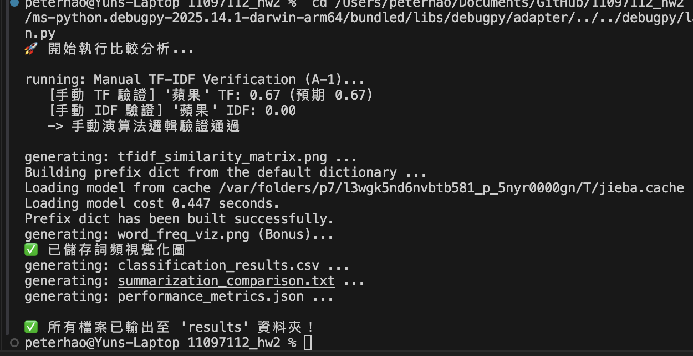

作業二心得報告：傳統 NLP 與現代 AI 的實作對話

學號：110971012

姓名：郝昀

1. 方法特性比較分析

本次作業讓我們親手從底層的 TF-IDF 算法刻畫到呼叫 GPT-4o API，這兩種截然不同的技術路徑，展現了 NLP 發展的縮影。

傳統方法 (Traditional Methods)，如 TF-IDF 與規則式分類，其最大的優勢在於**「透明度」與「可控性」。在實作 A-1 時，我可以清楚地追蹤每一個詞頻如何影響最終的相似度分數。這種白盒子特性在需要解釋決策原因的場景（如金融風控、法律檢索）至關重要。此外，傳統方法的運算成本極低，完全不需要 GPU 或昂貴的 API 費用，執行速度也極快。然而，其限制在於「語意斷層」**。例如在規則式分類器中，若使用者輸入了「這手機不賴」，但我的字典裡只有「不錯」，系統就可能無法正確判別，因為它缺乏對語言深層含義的理解。

現代 AI 方法 (Modern AI / LLM) 則展現了驚人的**「泛化能力」與「語意理解」。GPT-4o 不需要我定義繁瑣的關鍵字清單，就能讀懂「這部電影劇情空洞」是負面評價，甚至能理解反諷語氣。在自動摘要任務中，GPT 生成的語句通順度遠勝於統計式方法的拼湊句。然而，強大的能力伴隨著「不可預測性」與「高成本」**。每次呼叫 API 都需要等待回應，且結果可能因隨機性而略有不同（Hallucination），這在追求穩定輸出的工程系統中是一個需要被管理的風險。

2. 實作心得與困難排解

在本次實作中，我遇到最大的技術挑戰在於中文資料的前處理。

在實作 TF-IDF 時，我最初直接將中文句子丟入 TfidfVectorizer，結果計算出的相似度矩陣全是 0。經過排查才發現，不同於英文有空白分隔，中文必須先進行斷詞。我引入了 jieba 套件，並在嘗試過程中發現，若未載入適當的停用詞表（stop words），高頻無義詞（如「的」、「是」）會嚴重干擾 TF-IDF 的權重計算。這個除錯過程讓我深刻體會到，在傳統 NLP 中，特徵工程（Feature Engineering） 往往決定了模型的上限。

此外，我也嘗試了作業建議的 Word2Vec 加分題。相比於 TF-IDF 的稀疏矩陣，Word2Vec 將詞彙映射到稠密向量空間，成功解決了同義詞問題。雖然訓練過程比 TF-IDF 複雜，但看到「人工智慧」與「機器學習」在向量空間中距離相近時，那種對數學之美的感動是直接呼叫 GPT API 無法比擬的。

3. 應用建議與未來展望

經過這次的比較，我認為在未來的 AI 專案中，「混合模式 (Hybrid Approach)」 將是最佳解方：

分層處理：利用傳統方法的快速與低成本特性作為第一道濾網。例如在客服系統中，先用關鍵字規則過濾掉 80% 的簡單查詢（如查餘額、營業時間），剩下的 20% 複雜語意問題再轉交給 LLM 處理。

結果校驗：LLM 的生成結果有時會產生幻覺，我們可以利用傳統的搜尋引擎或資料庫來驗證 LLM 輸出的事實性（RAG 架構的概念）。

場景選擇：若任務是封閉域的精確匹配（如專有名詞檢索），傳統方法往往比 AI 更準確且不易出錯；若任務是開放域的生成與理解（如文案撰寫、情緒分析），則非 AI 莫屬。

總結來說，這次作業不僅讓我學會了如何呼叫 API，更重要的是讓我理解了這些黑盒子背後的數學原理。在這個 AI 快速迭代的時代，掌握基礎原理才能讓我們不被工具綁架，進而做出最正確的技術選型。

